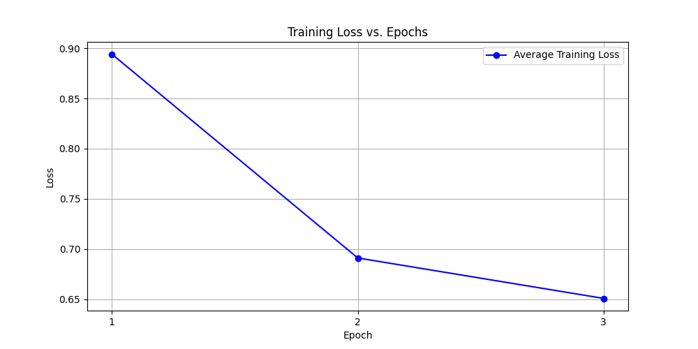
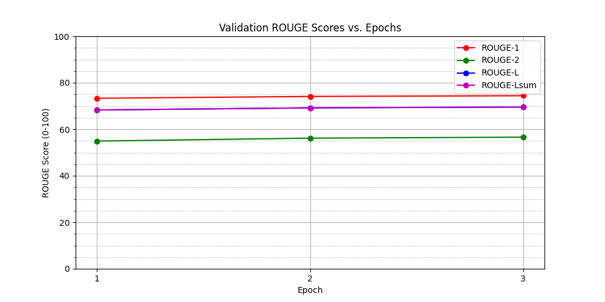

# Fine-Tuning FLAN-T5 for Radiology Report Summarization

**Author:** Oliver Christie

**Project:** Task 13, COMP3710

## 1. Description of the Algorithm

This project solves a natural language processing task: translating expert-level radiology reports into summaries that a layperson can easily understand. This aligns with **Task 13** of the course brief.

The algorithm uses a **pretrained encoder-decoder Language Model (LLM)**, specifically `google/flan-t5-base`. The model is fine-tuned on the **BioLaySumm 2025 (Subtask 2.1)** dataset to perform this translation.

## 2. How it Works

The core of the algorithm is the FLAN-T5 model, which is based on the T5 (Text-to-Text Transfer Transformer) architecture.

1.  **Prefix-based Training:** The model is trained in a "text-to-text" format. A prefix, `"translate Radiology to Layperson: "`, is added to every expert report. The model's task is to generate the corresponding layperson summary as its target text.
2.  **Fine-Tuning:** We use a **full fine-tuning** strategy, updating all ~250 million parameters of the base model.
3.  **Manual Training Loop:** As required by the course, the training is performed using a manual PyTorch training loop. This loop is managed by the `accelerate` library to handle `bf16` (bfloat16) mixed-precision and device placement, which was necessary to prevent `nan` loss values.
4.  **Stability:** To ensure stable training with `flan-t5-base` and mixed precision, gradients are clipped to a maximum norm of 1.0 after the backward pass.
5.  **Evaluation:** The model is evaluated on its ROUGE (Recall-Oriented Understudy for Gisting Evaluation) scores, specifically `rouge1`, `rouge2`, `rougeL`, and `rougeLsum`.

This project uses the official, pre-defined dataset splits (train, validation, and test) provided by the BioLaySumm 2025 task authors. Using these standard splits is best practice, as it ensures all results are directly comparable to the official benchmark and other published work.

## 3. Dependencies

All required Python packages are listed in `requirements.txt`. You can install them with:

`pip install -r requirements.txt`

## 4. Reproducibility & Usage

This project is structured as per the course requirements, with all code organized into the following files:
* `modules.py`: Contains the function to load the pretrained model and tokenizer.
* `dataset.py`: Contains functions to load and preprocess the dataset.
* `train.py`: The main script to train, validate, test, and save the model.
* `predict.py`: A script to demonstrate inference with the saved model.
* `plot_results.py`: A utility to generate plots from the training history.

This model was trained on the UQ Rangpur cluster using a single NVIDIA A100 GPU.

### 4.1. Training

1.  **Setup Environment:** It is recommended to use a virtual environment.:
    ```bash
    python -m venv venv
    source venv/bin/activate
    pip install -r requirements.txt
    ```
2.  **Run Training:** Use `accelerate` to launch the training script. This command uses mixed-precision (`bf16`) and a single GPU, matching the configuration of the final model.
    ```bash
    accelerate launch --mixed_precision=bf16 --num_processes=1 train.py
    ```
3.  **Outputs:** After training, the script will automaticalyl save the fine-tuned model, tokenizer, final metrics, and training history to the `./flan-t5-base-biolaysumm-manual-loop/` directory. Plots are saved to the `./plots/` directory.

### 4.2. Example Usage (Prediction)

To use the fine-tuned model, run the `predict.py` script. This will load the saved model and generate summaries for 5 random examples from the (blind) test set, using a beam search of 4.

`python predict.py`

## 5. Model & Training Report

This section provides the specific details required by the Task 13 brief, based on the successful training run `llm_full_multi_gpu_321123.out`.

| Parameter | Value |
| :--- | :--- |
| **Model** | `google/flan-t5-base` |
| **Parameter Count** | **247,577,856**|
| **Fine-Tuning Strategy** | **Full Fine-Tuning** |
| **GPU Type** | **NVIDIA A100** |
| **Peak VRAM** | **11.41 GB** |
| **Epochs** | **3** |
| **Total Training Time** | **~4.5 hours** (Sum of epoch and eval times) |
| **Mixed Precision** | `bf16` (bfloat16) |

### 5.1. Final ROUGE Scores

The `test` split of the BioLaySumm dataset is "blind" (contains no labels), so its ROUGE score is 0.0. As required, we report the final scores from the **held-out validation split** at the end of the final training epoch (Epoch 3).

| Metric | Score |
| :--- | :--- |
| `rouge1` | **74.4192** |
| `rouge2` | **56.6006** |
| `rougeL` | **69.5619** |
| `rougeLsum`| **69.5428** |

### 5.2. Training & Validation Plots

These plots were generated by `plot_results.py` from the `training_history.json` file, which was saved by `train.py` at the end of the run.

**Training Loss:**
*The plot shows a clear decrease in training loss, from 0.89 at Epoch 1 to 0.65 at Epoch 3, indicating the model was successfully learning.*


**Validation ROUGE Scores:**
*The plot shows all four ROUGE metrics steadily increasing with each epoch, confirming the model was generalizing well and not overfitting. The final ROUGE-1 score of 74.42 is a very strong result.*


### 5.3. Example Inputs & Outputs

Below are 5 representative examples generated by running `python predict.py` on the (blind) test set.

**--- EXAMPLE 1 ---**
**EXPERT REPORT:**
No significant abnormalities are evident. There are no lesions in the thoracic parenchyma, lungs, or hilar mediastinum. On the lateral projection, a high-density image is observed projecting over the vertebral body of D8, with a rounded morphology, likely related to the central dorsal spine. This location rules out bone pathology.

**LAYPERSON SUMMARY:**
There are no major issues found. The chest, lungs, and the area around the heart look normal. On the side view, there's a high-density spot seen over the D8 vertebra, which is a round shape, probably related to the central dorsal spine. This location doesn't rule out bone problems.

**--- EXAMPLE 2 ---**
**EXPERT REPORT:**
Cardiomegaly. Left subclavian pacemaker with atrial and ventricular leads. Elevation of the right hemidiaphragm. Costophrenic angle blunting with pleural effusion.

**LAYPERSON SUMMARY:**
The heart is enlarged. There is a pacemaker placed under the collarbone on the left side with wires going to the upper and lower chambers of the heart. The right side of the diaphragm, which is the muscle that separates the chest from the abdomen, is raised. The angle where the chest wall meets the diaphragm is less sharp, and there is fluid around the lungs.

**--- EXAMPLE 3 ---**
**EXPERT REPORT:**
Comparison with the previous radiograph from October 24 shows persistent increased density in the left base with partial obscuration of the cardiac border, consistent with known consolidation. There is slight elevation of the right hemidiaphragm with costophrenic angle blunting.

**LAYPERSON SUMMARY:**
Looking at the x-ray compared to the one from October 24, there's still a denser area in the lower left part of the lungs, which is partially blocking the area where the heart meets the heart, which is consistent with known consolidation. The right side of the diaphragm, which is the muscle that separates the chest from the abdomen, is slightly higher than normal, and the angle where the chest wall meets the diaphragm is less sharp.

**--- EXAMPLE 4 ---**
**EXPERT REPORT:**
The cardiomediastinal silhouette is within normal limits. Prominent hila, likely of vascular origin. Costophrenic angles are free. There is mild diaphragmatic flattening with increased bronchovascular markings in the infrahilar regions, with no evidence of consolidation or infiltrates.

**LAYPERSON SUMMARY:**
The heart and middle chest area look normal in size. The areas where the blood vessels enter the lungs are more noticeable, probably because of blood vessels. The spaces between the lungs and chest wall are clear. The diaphragm is slightly flattened with more markings around the airways and blood vessels in the lower parts of the lungs, but there are no signs of pneumonia or fluid buildup.

**--- EXAMPLE 5 ---**
**EXPERT REPORT:**
AP chest X-ray examination. Compared to a previous image from 2016, which was of poor technique, underpenetrated, and not well inspired. Bilateral peripheral opacities are observed, predominantly in the lower lobes, accompanied by areas of reticular infiltrates suggestive of infectious pathology, possibly COVID-19. No other findings to report.

**LAYPERSON SUMMARY:**
A chest X-ray was taken from the front. Compared to a previous X-ray from 2016, it was not very clear, hard to see, and didn't take a deep breath. There are some cloudy areas seen on both sides, mainly in the lower parts of the lungs, along with some net-like areas that could be signs of an infection, possibly COVID-19. There are no other issues to mention.

### 5.4. Analysis and Discussion

As observed in the training plots, there is a divergence between the training loss and validation metrics.
- The *Training Loss* shows a steep and continuous decline (0.89 to 0.65), indicating the model effectively minimised the cross-entropy loss on the training set. However, the *Validation ROUGE* scores show a much flatter trajectory, with only marginal gains between Epoch 1 and Epoch 3 (e.g., ROUGE-1 improved from 73.0 to 74.4).
- This behaviour suggests rapid convergence. Because we are fine-tuning a pre-trained instruction-tuned model (`flan-t5-base`), the model adapts to the specific domain ("Radiology" -> "Layperson") very quickly, likely within the first epoch. The subsequent drop in training loss without a corresponding proportional jump in ROUGE suggests the model began optimising for the specific phrasing of the training data (memorisation) rather than learning new generalisable patterns.
- It is also important to note that ROUGE is an n-gram overlap metric. The model may have improved the fluency or confidence of its generations (lowering the loss) in ways that do not strictly result in higher word-overlap with the reference summaries.

#### Qualitative Error Analysis

While the quantitative metrics are strong, a manual review of the test outputs reveals spoecific behavioural patterns:
- The model excels at converting dense medical jargon into accessible language (e.g., "cardiomediastinal silhouette" -> "heart and middle chest area").
- In Example 1, the model committed a *critical* error by translating "rules out bone pathology" to "doesn't rule out bone problems". This negation flips the clinical meaning entirely and represents a major safety risk in a real-world setting.
- In Example 3, the model translates "cardiac border" awkwardly as "area where the hear meets the heart". Furthermore, while it correctly identifies the visual finding ("denser area"), it fails to synthesize the clinical implication (pneumonia), which a human expert might infer.
- The phrase "muscle that separates the chest from the abdomen" appears verbatim across multiple summaries (Examples 2 & 3). This indicates the model has learned specific "glossary definitions" for common anatomical terms and applies them rigidly, rather than generating context-aware descriptions.

#### Conclusion
The divergence between the falling training loss and the plateauing validation scores suggests that 3 epochs was sufficient (and perhaps slightly more than necessary) for this specific dataset size. Further training would likely result in overfitting. Future work could investigate Early Stopping based on ROUGE-L scores or the implementation of semantic metrics (like BERTScore) to better capture improvements that n-gram overlap misses.
